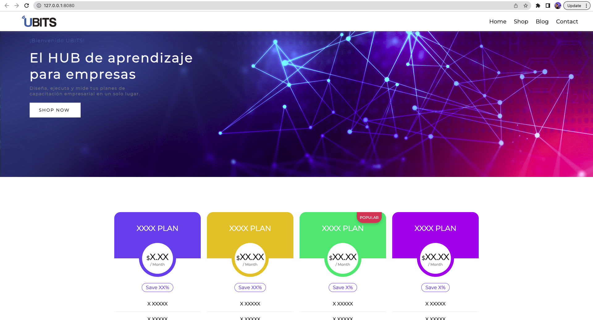
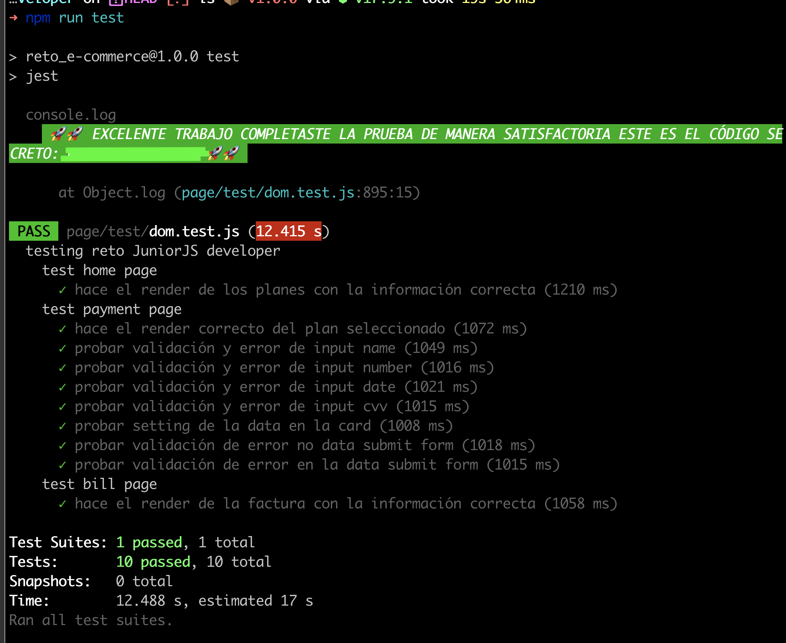
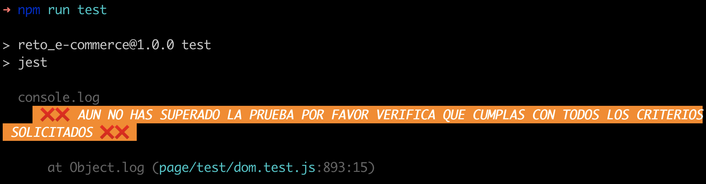

# 🤓 Reto UBITS

Bienvenido a tu reto final para crear un E-commerce, para nosotros es un gusto que puedas poner a prueba tus los conocimientos que vienes aprendiendo en nuestros curso de Javascript.

## ☑️ Requisitos para realizar el reto

- tener instalado node v16 o superior
- tener instalado npm 8 o superior
- tener un un powerShell, shell o terminal con el cual ejecutar lineas de comandos
- tener un editor de código donde realizar el reto (ej: visual studio code)
- tener cuenta de gitHub activa

## ⏲ Setup del reto

Para poder solucionar este reto de una manera correcta debes seguir los siguientes pasos:

### 1. Clonar el reto localmente

Primero debes clonar el reto en tu maquina para que puedas acceder a la información del reto y su estructura, para esto escribe el siguiente comando en tu shell:

**Si tienes configurada una llave SSH**

```bash
git clone git@github.com:buty619/Desafio_UBITS_junior_web_developer.git
```

**para clonarlo por HTTPS**

```bash
git clone https://github.com/buty619/Desafio_UBITS_junior_web_developer.git
```

### 2. Instalar dependencias

luego de clonarlo accede a la carpeta que acabas de clonar e instala las dependencias necesarias para el reto (si no conoces el concepto de dependencias no te preocupes no es necesario conocer su funcionamiento para resolver el reto) para esto escribe en tu shell:

```bash
cd Desafio_UBITS_junior_web_developer
```

```bash
npm install
```

✅ listo con estos pasos estas listo para iniciar tu reto mucha suerte ¡¡¡

### 🗒 Estructura del reto

En este repositorio encontraras una carpeta con el nombre [page](#) esta contiene 3 archivos:

- **README.md**: este archivo contiene las instrucciones para resolver el reto por favor léelo cuidadosamente.
- **index.html**: esta es la estructura html de la pagina principal de nuestro reto.
- **payment.html**: esta es la estructura html de la pagina de pago.
- **bill.html**: esta es la estructura html de la pagina de factura.

también podrás encontrar las siguientes carpetas la cual detallaremos a continuación:

- **assets**: esta carpeta contiene las imágenes usadas por nuestra pagina web.
- **css**: esta carpeta contiene los estilos usados por nuestra pagina web.
- **js**: esta carpeta contiene los **archivos javascript donde debemos solucionar nuestro reto**.
  - **home.js**: en este archivo se solucionara la primera parte del reto que modifica al archivo **index.html**.
  - **payment.js**: en este archivo se solucionara la segunda parte del reto que modifica al archivo **payment.html**.
  - **bill.js**: en este archivo se solucionara la segunda parte del reto que modifica al archivo **bill.html**.

ademas de estas carpetas podrás ver otros archivos como:

- .gitignore
- babel.config.json
- package.json

no te preocupes por estos archivos ellos realizan un trabajo de configuración de nuestro reto y no es necesario profundizar en ellos.

### :gear: como hacer el setup del reto, correrlo y validar los cambios:

para poder correr este reto localmente debes correr en tu shell el comando

```bash
npm run start
```

esto inicia un servidor que corre nuestra pagina web y el cual detectara y actualizara los cambios que hagamos en el proyecto, luego abre en tu browser favorito ve a la url:

```bash
http://127.0.0.1:8080/
```

deberás ver algo como lo que se muestra a continuación

<p align="center">
  
</p>

### 🚀 ¿Como saber si complete el reto?

luego que hayas leído las instrucciones y hayas puesto a prueba todo tu conocimiento la manera correcta de saber si resolviste el reto es escribiendo estos comandos en tu shell:

```bash
npm run test
```

se correrán los test de tu código donde si lo tienes correctamente solucionado podrás ver un mensaje como:

<p align="center">
  
</p>

si por el contrario tienes algún error verás un mensaje como:

<p align="center">
  
</p>

en caso de completar la prueba exitosamente podrás ver el mensaje mencionado el cual expondrá un código secreto el cual podrás usar para validar la solución en nuestra plataforma UBITS.

# 🥳 ¡Buena suerte! 🥳
