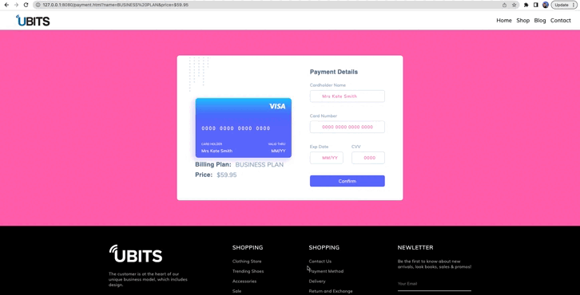
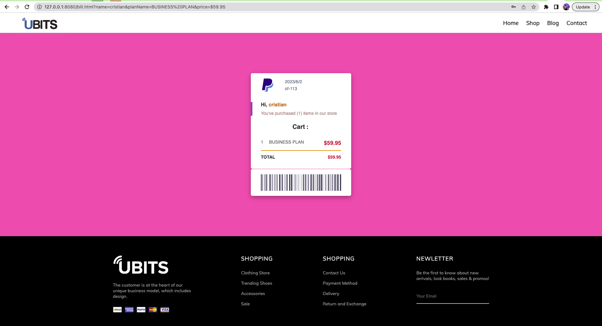

# 🚀 Parte 1: Mostrar la lista de planes de nuestra pagina UBITS

## ☑️ Instrucciones

En este reto, vamos a completar un código que obtiene información sobre diferentes planes de precios desde una API y luego inyecta esos datos en elementos HTML para mostrarlos en una página. Sigue los siguientes pasos para completar el código:

1. Realizar una solicitud GET a la API para obtener la información de los planes de precios.

   - URL de la API: `https://buty619.github.io/pricing.json`
   - Observa la estructura de la información obtenida en tu navegador para comprender cómo acceder a los datos que necesitamos.

2. Inyectar la información obtenida en el HTML de cada tarjeta de plan.
   2.1. Obtener el elemento card del plan "Basic" utilizando su clase (`pricing-card.basic`).
      - 2.1.1. Inyectar el nombre del plan obtenido de la API en el título de la tarjeta (`plan-title`).
      - 2.1.2. Inyectar el precio del plan obtenido de la API en el componente de precio que consta de las etiquetas `<small>` y `` (`price-title`).
      - 2.1.3. Inyectar el valor del descuento de este plan en el span que se encuentra dentro del elemento con clase `badge-box`.
      - 2.1.4. Completar la información de las características del plan. Puedes obtener un array con los elementos `<li>` y recorrerlos para agregar las características del plan.

3. Agregar una acción a los botones de cada tarjeta para que nos redirijan a la página `/payment` enviando como parámetros de consulta el nombre y el precio del plan seleccionado.
   - Ejemplo: `/payment.html?name='Basic'&price='$6.95'`

Puedes utilizar métodos de iteración para reutilizar el código implementado para la primera tarjeta o realizar el proceso para cada tarjeta de manera individual. Cualquiera de las dos soluciones es válida, pero te incentivamos a probar tus conocimientos utilizando un método de iteración sobre la información obtenida de la API.

Una vez que hayas completado el código, este se inicializará automáticamente para mostrar la información de los planes en la página web.

¡Buena suerte!

### 🗒 NOTAS:

Se muestra el comportamiento esperado de la primera parte del reto.

  

# 🚀 Parte 2: Formulario de Compra 🛒

## ☑️ Instrucciones

Sigue las instrucciones paso a paso para completar el formulario:

1. **Obtén los valores del plan comprado**:

   - Obtén los valores del nombre y precio del plan comprado de las `query params` de la URL y guárdalos en las variables `planName` y `planPrice`.
   - Utiliza el método `URLSearchParams` y `window.location.search` para obtener los parámetros.

2. **Inyecta los valores del plan comprado en el HTML**:

   - Inyecta los valores obtenidos en los `billing_details` del HTML para que el usuario vea qué plan compró.

3. **Crea una función `showError`**:

   - Crea una función llamada `showError` que acepte dos parámetros: el elemento HTML que tiene el error y un booleano que cambiará el estilo del elemento. Si hay un error, cambia la opacidad del elemento inyectado a la función a `1`, de lo contrario, cambia el valor de la opacidad a `0`.

4. **Agrega un event listener al input `name`**:

   - Agrega un event listener al input `name` (nombre) que se ejecute en la acción `input`.
   - Captura el elemento `alert-1` y, si el valor del input está vacío (`value === ""`), muestra el error utilizando la función `showError`.
   - Además, inyecta el valor de este input en el elemento `card-name` para que aparezca en la tarjeta de la compra.

5. **Agrega un event listener al input `number`**:

   - Agrega un event listener al input `number` (número de tarjeta de crédito) que se ejecute en la acción `input`.
   - Captura el elemento `alert-2` y, si el valor del input no tiene 19 caracteres (`value.length !== 19`), muestra el error utilizando la función `showError`.
   - Utiliza la función `numberAutoFormat` para darle formato esperado al número de tarjeta y luego inyecta este valor en el elemento `card__number` para que se muestre en la tarjeta de la compra.

6. **Agrega un event listener al input `date`**:

   - Agrega un event listener al input `date` (fecha de vencimiento de la tarjeta) que se ejecute en la acción `input`.
   - Captura el elemento `alert-3` y, utilizando la función `isNotDate`, determina si se ha ingresado una fecha válida o no. Si no es válida, muestra el error utilizando la función `showError`.
   - Luego, utiliza la función `dateAutoFormat` para darle el formato esperado a la fecha y luego inyecta los valores del mes y el año en los elementos `month` y `year`, respectivamente, para mostrarlos en la tarjeta de la compra.

7. **Agrega un event listener al input `cvv`**:

   - Agrega un event listener al input `cvv` (código CVV) que se ejecute en la acción `input`.
   - Captura el elemento `alert-4` y, si el valor del input es menor a 3 (`value.length < 3`), muestra el error utilizando la función `showError`.

8. **Agrega el evento `submit` al formulario**:
   - Agrega el evento `submit` al formulario para completar la compra del paquete.
   - Valida nuevamente cada campo del formulario con las mismas reglas mencionadas anteriormente.
   - Si se detecta un error en algún campo, muestra el campo con error.
   - Utiliza `preventDefault()` para evitar que la página se recargue al enviar el formulario.
   - Redirige al usuario a la página de facturación (`/bill.html`), para esto utiliza el metodo `window.location.assign` y envía los parámetros `name` (nombre del comprador), `planName` (nombre del plan comprado) y `price` (precio del plan comprado) en las `query params`.

¡Buena suerte! 🚀

### 🗒 NOTAS:

Se muestra el comportamiento esperado de la segunda parte del reto.

  

# 🚀 Parte 3: Factura de venta 📥

## Instrucciones:

1. **Obtener los valores de las `query params`**:

   - Utiliza el método `URLSearchParams` y `window.location.search` para obtener los valores del nombre de usuario, el nombre del plan y el precio del plan comprado de las `query params`.
   - Guárdalos en las variables `userName`, `planName` y `planPrice`.

2. **Inyectar los valores en el HTML**:

   - Utiliza las variables obtenidas en el paso anterior para inyectar los valores en los elementos correspondientes del HTML.
   - Encuentra los elementos HTML utilizando los selectores adecuados y asigna los valores a sus propiedades `innerHTML`.

3. **Inyectar la fecha actual**:
   - Utiliza la función `Date` para obtener la fecha actual.
   - Extrae el año, el mes y el día de la fecha actual y guárdalos en las variables `year`, `month` y `day`.
   - Encuentra el elemento HTML correspondiente a la fecha de la factura y asigna el valor formateado utilizando las variables obtenidas.

¡Buena suerte! 🚀

### 🗒 NOTAS:

Se muestra el comportamiento esperado de la tercera parte del reto.

  

# ✨ Espero te diviertas completando este reto, comparte en tus redes los resultados de este ejercicio.
